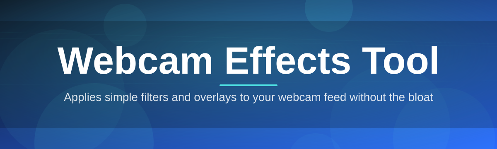

# webcam-effects-overlay 🎭✨

  

*Turn your plain webcam feed into a stage — overlays, filters, and virtual set dressing, without touching a single dependency.*

  

---

## ⚡ Three Steps and You're Live

1. **Grab it** — hit the download button below and save the standalone `.exe`.
2. **Launch it** — no installer wizard, no admin prompts, just double-click.
3. **Pick your camera and effect** — the overlay engine attaches instantly and streams into any app that reads a webcam device.

That's it. Everything below is just the "why" and the "how deep does this go."

---

## 🌟 Overview

**webcam-effects-overlay** is a lightweight Windows utility that sits between your physical webcam and whatever software is asking for a video feed — Zoom, OBS, Discord, Teams, browser video calls, streaming software, anything. It intercepts the raw feed, runs it through a real-time effects pipeline, and hands off a polished, styled, or augmented stream as if it were coming straight from the camera. No cloud processing, no background telemetry, no bloated companion app — just a small, focused **webcam effects tool** doing one job extremely well.

The project exists because most webcam software either locks premium filters behind a subscription or ships with a UI so cluttered it takes longer to find the settings than to actually record something. We wanted an overlay tool that respects your CPU, your privacy, and your time — something a streamer, a remote worker doing back-to-back calls, or a hobbyist building a virtual studio could open cold and understand in under a minute.

Whether you're dressing up a boring video call, building a lightweight virtual production setup, or just want a fun face filter for a family call, this tool aims to be the dependable layer between "camera" and "audience" — fast to start, easy to tune, and quiet about it.

> [!TIP]
> First time here? The landing page also lists changelogs and known compatibility notes for each Windows build — worth a skim before your first launch.

---

## 🧰 What's Inside the Toolbox

| Capability | What It Actually Does |
|---|---|
| **Live Background Replacement** | Swaps out messy rooms for solid colors, blurred depth, or custom images — processed frame-by-frame with no green screen required. |
| **Layered Overlay Compositing** | Stack PNG/GIF overlays — frames, lower-thirds, mascots, stickers — with adjustable opacity and z-order. |
| **Real-Time Color Grading** | Apply cinematic LUT-style grading presets so your feed doesn't look like it's lit by a fridge bulb. |
| **Face-Reactive Filters** | Track facial landmarks to trigger effects — glasses, masks, particle bursts — that move naturally with you. |
| **Virtual Camera Passthrough** | Publishes a clean virtual device that any conferencing or streaming app can select like a normal webcam. |
| **Scene Presets & Hotswap** | Save full effect stacks as named scenes and flip between them instantly with a hotkey. |
| **Low-Latency Pipeline** | Optimized frame buffer handling keeps delay imperceptible, even on modest laptops. |
| **Multi-Camera Awareness** | Detects and remembers settings per physical camera, so switching devices doesn't mean reconfiguring everything. |

> [!NOTE]
> Every effect in the table above runs locally on your machine. Nothing is uploaded, rendered remotely, or logged externally.

---

## 🚀 Getting Started, the Slightly Longer Version

<strong>Click to expand full setup walkthrough</strong>

1. Visit the project landing page (link in the download button above).
2. Download the latest standalone build — it's a single portable executable, nothing to unpack.
3. Run it directly. Windows SmartScreen may flag it as unrecognized on first launch since it's an independently signed indie tool — click "More info → Run anyway."
4. Select your physical webcam from the source dropdown, choose an effect or scene, and confirm the virtual camera output in your conferencing app's video settings.

> [!IMPORTANT]
> Always download from the official landing page linked in this README. Third-party mirrors are not maintained by this project and may ship outdated or altered builds.

---

## 🖥️ System Requirements

| Requirement | Detail |
|---|---|
| OS | Windows 10 or Windows 11 (64-bit) |
| Dependencies | None — fully standalone executable |
| Camera | Any UVC-compliant webcam (built-in or USB) |
| RAM | 4 GB minimum, 8 GB recommended for heavier overlay stacks |
| GPU | Integrated graphics sufficient; dedicated GPU improves high-res performance |

  

---

## 🔍 How It Works

The pipeline is intentionally simple to reason about — a straight line from raw camera to composited output, no hidden detours.

1. **Capture** — the tool grabs raw frames from your selected physical webcam via standard Windows capture APIs.
2. **Process** — each frame passes through your active effect stack: background handling, color grading, overlays, face-reactive layers.
3. **Composite** — layers are merged in the order you've configured, respecting opacity and blend settings.
4. **Publish** — the finished frame is pushed to a virtual camera device that other apps can select.
5. **Repeat** — this happens dozens of times per second, which is why latency tuning matters so much internally.

---

## 🩹 Troubleshooting

**Q: My conferencing app doesn't see the virtual camera.**
A: Restart the conferencing app after launching webcam-effects-overlay — most apps only scan for video devices at their own startup.

**Q: The overlay lags a second or two behind my movements.**
A: Lower your resolution preset or disable face-reactive filters temporarily — those are the heaviest part of the pipeline on weaker CPUs.

**Q: Windows says the app is from an "unknown publisher."**
A: This is expected for independently distributed tools without a paid code-signing certificate. The binary itself is unmodified from the official release.

**Q: My background replacement has a flickering edge around my hair.**
A: Improve lighting behind you or switch from "sharp" to "soft" edge mode in background settings — segmentation accuracy scales with contrast.

**Q: Can I run two camera sources at once?**
A: Not currently — one physical source feeds one virtual output per running instance. Multi-source compositing is tracked as a future enhancement.

**Q: The app won't detect my external USB webcam.**
A: Unplug and replug the device, then reopen the source dropdown — some USB controllers register late relative to app launch.

---

## 🎨 UI, UX & Personalization

> [!TIP]
> Hold `Shift` while dragging an overlay layer to constrain its movement to a straight axis — handy for lining up frames and lower-thirds precisely.

| Shortcut | Action |
|---|---|
| `Ctrl + 1-9` | Instantly switch between saved scenes |
| `Space` | Toggle all effects on/off (raw passthrough) |
| `Ctrl + S` | Save current stack as a new scene |
| `Ctrl + Shift + R` | Reset pipeline if a frame gets stuck |
| `F` | Cycle face-reactive filter set |

- **Themes:** Light, Dark, and an auto mode that follows Windows' system theme.

- **Settings persistence:** every scene, overlay position, and hotkey binding is saved locally between sessions — no account, no sync server.

- **Compact mode:** collapses the control panel into a slim strip so it doesn't dominate your second monitor during a call.

> [!WARNING]
> Resetting the pipeline (`Ctrl+Shift+R`) clears any unsaved overlay adjustments for the active session — save your scene first if you like the current look.

---

## 🤝 Contributing & Community

This project grew from a small personal utility into something a genuinely welcoming group of contributors now shapes together — and there's always room for more hands.

> [!NOTE]
> New to open source? Look for issues tagged **good first issue** — they're deliberately scoped to be approachable, well-described, and mentor-friendly.

- 🐛 **Found a bug?** Open an issue with your Windows build, camera model, and steps to reproduce.

- 💡 **Have an idea for an effect?** Feature requests are genuinely read, discussed, and often shipped.

- 🧑‍💻 **Want to write code?** Check open issues, comment to claim one, and don't be shy about asking questions in the discussion thread — that's what it's there for.

- 📖 **Not a coder?** Documentation fixes, translation help, and testing on unusual hardware setups are just as valuable as code contributions.

---

## 📜 License

Released under the [MIT License](LICENSE), 2026. Use it, fork it, build on it — just carry the license forward.

---

## ⚠️ Disclaimer

webcam-effects-overlay is provided as-is, without warranty of any kind. Effects that rely on face or background detection are approximations, not guarantees — lighting, camera quality, and hardware will all affect results. This project is not affiliated with any conferencing or streaming platform it happens to work alongside.

